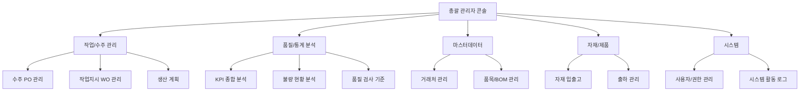
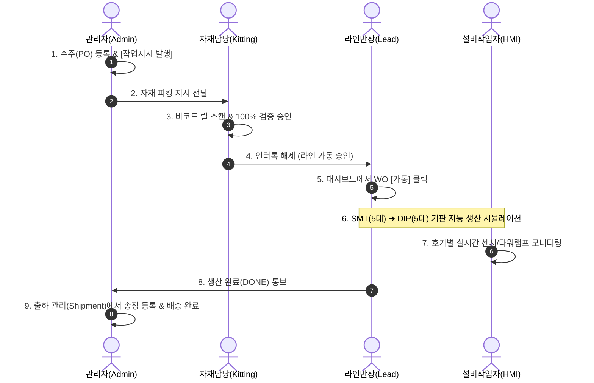

# 🏭 MES PRO 시스템 관리자(Admin) & 설비 HMI(Machine) 상세 기능 가이드 및 테스트 매뉴얼

본 문서는 **MES PRO 시스템**의 **총괄 관리자(Admin) 콘솔 12개 메뉴**와 **설비 HMI(Machine) 관제 10대 설비**의 주요 기능 설명, 실제 백엔드/DB 연동 원리, 그리고 직접 시연해 볼 수 있는 **단계별 실습 테스트 시나리오**를 상세히 제공합니다.

---

## 📑 목차
1. [시스템 접근 및 역할별 로그인 계정](#1-시스템-접근-및-역할별-로그인-계정)
2. [관리자 메뉴 (Admin Console) 12개 메뉴 상세 & 테스트](#2-관리자-메뉴-admin-console-12개-메뉴-상세--테스트)
   - [① 수주 (PO) 관리](#1-수주-po-관리-order)
   - [② 작업지시 (WO) 관리](#2-작업지시-wo-관리-wo)
   - [③ 생산 계획](#3-생산-계획-plan)
   - [④ KPI 종합 분석](#4-kpi-종합-분석-kpi)
   - [⑤ 불량 현황 분석](#5-불량-현황-분석-defect)
   - [⑥ 품질 검사 기준](#6-품질-검사-기준-quality-std)
   - [⑦ 거래처 마스터 관리](#7-거래처-마스터-관리-company)
   - [⑧ 품목 마스터 & BOM 관리](#8-품목-마스터--bom-관리-item)
   - [⑨ 자재 입출고 관리](#9-자재-입출고-관리-material)
   - [⑩ 출하 관리](#10-출하-관리-shipment)
   - [⑪ 사용자 / 권한 관리](#11-사용자--권한-관리-users)
   - [⑫ 시스템 활동 로그](#12-시스템-활동-로그-log)
3. [설비 HMI (Machine Interface) 10대 설비 관제 & 테스트](#3-설비-hmi-machine-interface-10대-설비-관제--테스트)
   - [HMI 공통 인터페이스 및 원터치 제어](#hmi-공통-인터페이스-및-원터치-제어)
   - [Line 1: SMT 자삽/표면실장 라인 (5대)](#line-1-smt-자삽표면실장-라인-5대)
   - [Line 2: DIP 수삽 & 후공정 라인 (5대)](#line-2-dip-수삽--후공정-라인-5대)
4. [엔드-투-엔드(E2E) 풀 사이클 시연 시나리오](#4-엔드-투-엔드e2e-풀-사이클-시연-시나리오)

---

## 1. 시스템 접근 및 역할별 로그인 계정

로그인 URL: `http://localhost:8080` (접속 시 자동으로 `login.html`로 이동)

| 역할 (Role) | 비밀번호 (Quick Button) | 기본 진입 화면 | 주요 권한 및 특징 |
| :--- | :--- | :--- | :--- |
| **👑 경영진 (CEO)** | `ceo` | `ceo.html` | 경영 요약 KPI, 실시간 라인 가동 오버레이 참관 |
| **⚙️ 총괄 관리자 (Admin)** | `admin` | `admin.html` | 12개 관리 메뉴 전체 CRUD 및 전 화면 자유 이동 |
| **📊 라인 반장 (Supervisor)** | `supervisor` | `dashboard.html` | 10대 풀-파이프라인 라인 관제, 긴급 지시 |
| **📦 자재 담당자 (Kitting)** | `kitting` | `kitting.html` | 바코드 스캔, 피더 셋업 검증, 오투입 포카요케 |
| **🔧 설비 작업자 (Machine)** | `machine` | `machine.html` | 10대 설비 1:1 관제, 타워램프, E-STOP, TPM 리셋 |

> 💡 **스마트 복귀 네비게이션**: 상위 권한자(`admin`, `ceo`, `supervisor`)가 하위 화면에 접속하면, 헤더 우측에 **`[⚙️ 관리자 콘솔 복귀]`** 등 본 화면으로 즉시 되돌아가는 스마트 복귀 버튼이 자동 생성됩니다.

---

## 2. 관리자 메뉴 (Admin Console) 12개 메뉴 상세 & 테스트

로그인 후 상단 좌측 메뉴 사이드바를 통해 12개 메뉴를 자유롭게 전환할 수 있습니다.



---

### ① 수주 (PO) 관리 (`order`)
- **기능 설명**: 고객사로부터 접수된 구매 발주(PO)를 등록/관리하며, 발주된 수주 내역을 바탕으로 원클릭으로 작업지시(WO)를 자동 발행합니다.
- **백엔드 연동 API**: `get_orders.php`, `create_order.php`, `update_order.php`, `delete_order.php`, `convert_order_to_wo.php`
- **테스트 방법**:
  1. 우측 상단 `[+ 수주 등록]` 버튼 클릭.
  2. 고객사(예: 현대모비스), 품목(Main Board A타입), 수량(500), 단가(125,000원), 납기일 선택 후 `[저장]` 클릭.
  3. 테이블에 신규 생성된 수주 건 확인.
  4. 테이블 우측 관리 열의 **`[작업지시 발행]`** 버튼 클릭 ➔ 작업지시 번호(예: `WO-20260817-001`)가 자동 부여되며 즉시 작업지시 관리(`wo`) 메뉴로 연계 이동됨 확인.

---

### ② 작업지시 (WO) 관리 (`wo`)
- **기능 설명**: 칸반(Kanban) 보드 형태로 대기, 진행 중, 완료된 작업지시를 한눈에 관리하고 라인 가동/정지/전환을 통제합니다.
- **백엔드 연동 API**: `get_admin_wo_list.php`, `create_wo.php`, `start_wo.php`, `stop_wo.php`, `switch_line_wo.php`, `reset_line.php`
- **테스트 방법**:
  1. `[대기 / 진행 중]` 열에서 등록된 작업지시 카드 확인.
  2. 카드 우측의 **`[▶ 가동]`** 버튼 클릭 ➔ 백엔드 시뮬레이터 워커가 백그라운드에서 가동되며 실시간 생산 카운트가 올라감.
  3. **`[⏸ 정지]`** 버튼을 눌러 일시 정지하거나, **`[긴급 라인전환]`**을 눌러 SMT/DIP 공정 우선순위를 즉시 변경 가능.
  4. 상단 `[라인 리셋]` 버튼을 누르면 라인의 모든 설비 상태가 초기화됨.

---

### ③ 생산 계획 (`plan`)
- **기능 설명**: 일자별 라인 부하량(Line 1 SMT / Line 2 DIP)과 납기 타임라인을 캘린더/간트 뷰로 시각화합니다.
- **백엔드 연동 API**: `get_production_plan.php`
- **테스트 방법**:
  1. 상단 날짜 선택기에서 날짜를 변경하거나 `[오늘]` 버튼 클릭.
  2. 선택한 날짜에 배정된 작업지시 목록 및 계획 수량 대비 달성률 확인.
  3. 라인 1과 라인 2의 시간당 가동 스케줄 바 확인.

---

### ④ KPI 종합 분석 (`kpi`)
- **기능 설명**: 7일/14일/30일 수율(Yield) 추이 차트, 납기 준수율, 공정별 불량률, 설비 가동 효율(OEE)을 분석합니다.
- **백엔드 연동 API**: `get_kpi_analytics.php`
- **테스트 방법**:
  1. 상단 기간 필터(`7일`, `14일`, `30일`) 버튼 클릭.
  2. 기간에 맞춰 캔버스 수율 트렌드 라인 차트와 막대그래프가 실시간으로 재계산되어 그려지는지 확인.
  3. SPI, AOI, ICT 등 공정별 파레토 불량 점유율 확인.

---

### ⑤ 불량 현황 분석 (`defect`)
- **기능 설명**: **공정별 불량 점유율**, **업체별 불량 점유율**, **최근 불량 발생 이력** 3가지 핵심 영역을 화면에 3분할로 나란히 배치하여 한눈에 비교 분석할 수 있으며, **공정별/업체별 드롭박스 검색 필터**를 통해 원하는 조건만 즉시 필터링할 수 있습니다.
- **백엔드 연동 API**: `get_defects.php?start_date=...&end_date=...&process=...&company_name=...`
- **테스트 방법**:
  1. 상단 기간 필터 및 **`공정` 드롭박스** (`전체`, `SPI`, `REFLOW`, `DIP_AOI` 등) 선택.
  2. **`업체` 드롭박스** (`전체`, `LG전자`, `현대모비스` 등) 선택 후 `[🔍 조회]` 클릭 (또는 드롭박스 변경 시 즉시 자동 조회).
  3. 좌측/중앙/우측 3열 카드가 선택한 필터 조건에 맞춰 실시간으로 동기화되어 갱신되는지 확인:
     - **1열 (좌측)**: 공정별 불량 점유율 바 차트 (바 클릭 시 해당 공정으로 원터치 필터링)
     - **2열 (중앙)**: 업체별 불량 점유율 바 차트 (바 클릭 시 해당 업체로 원터치 필터링)
     - **3열 (우측)**: 최근 불량 발생 이력 테이블 (바코드, 공정, WO, 업체, 발생시각 실시간 목록)

---

### ⑥ 품질 검사 기준 (`quality-std`)
- **기능 설명**: SMT/DIP 각 공정별 품질 합격/불량 판정 기준을 등록/관리합니다. 공정을 선택하면 해당 공정의 **대표 검사 항목이 드롭박스(콤보)로 자동 연동**되며, **`[🎯 표준]`**, **`[⚡ 타이트 (정밀)]`**, **`[📏 여유 (넓은 공차)]`** 3가지 추천 프리셋 버튼을 통해 원클릭으로 기준값과 단위가 자동 입력됩니다. 직접 타이핑 입력도 100% 지원합니다.
- **백엔드 연동 API**: `get_quality_standards.php`, `save_quality_standard.php`, `delete_quality_standard.php`
- **테스트 방법**:
  1. `[+ 기준 등록]` 버튼 클릭.
  2. **공정명**에 `SPI` 입력 또는 선택 ➔ **검사 항목** 드롭다운에 `솔더 페이스트 도포 체적율`, `솔더 도포 높이 편차` 등이 즉시 나타남 확인.
  3. `솔더 페이스트 도포 체적율` 선택 ➔ 기준값(`100 ± 20`)과 단위(`%`)가 자동 세팅됨 확인.
  4. 하단의 **`[⚡ 타이트 (정밀 공차)]`** 클릭 ➔ 기준값이 `100 ± 10`으로 즉시 변경되는지 확인.
  5. `[저장]` 클릭 후 테이블에 정상 등록 및 공정 필터링 동작 확인.

---

### ⑦ 거래처 마스터 관리 (`company`)
- **기능 설명**: 협력사(부품 납품처) 및 고객사(발주처) 정보를 등록하고, 거래처별 누적 발주/수주 금액 및 WO 건수를 집계합니다.
- **백엔드 연동 API**: `get_companies.php`, `get_companies_detail.php`, `create_company.php`, `update_company.php`, `delete_company.php`
- **테스트 방법**:
  1. `[+ 거래처 등록]` 클릭 ➔ 업체명(LG전자), 사업자번호, 담당자, 연락처 입력 후 저장.
  2. 테이블에서 거래처 상세 정보 및 연계된 WO 통계 확인.

---

### ⑧ 품목 마스터 & BOM 관리 (`item` / `wo`의 BOM 등록)
- **기능 설명**: 생산 품목(PCB 기판)별 부품 명세서(BOM)를 엑셀 붙여넣기로 일괄 등록하고 마운터 피더 슬롯 매핑을 구성합니다. **`[✔ 사급 자재로 창고 입고 자동 등록]`(기본값: true)** 옵션을 통해 BOM 등록과 동시에 해당 고객사의 사급 자재 실물 입고까지 원클릭으로 자동 연계 처리됩니다.
- **백엔드 연동 API**: `get_items.php`, `create_item.php`, `get_bom.php`, `save_bom.php` (`auto_inbound: true`)
- **테스트 방법**:
  1. `작업지시 (WO) 관리`에서 특정 작업지시의 **`[BOM]`** 버튼 클릭.
  2. 엑셀 데이터(파트번호, 파트명, 제공수량, 실장위치)를 붙여넣고 `[불러오기]` 클릭.
  3. 열 매핑 확인 후 **`[✔ 사급 자재로 창고 입고 자동 등록]`** 체크 확인 ➔ `[BOM 저장 및 입고 처리]` 클릭.
  4. "BOM 저장 완료 (사급 자재 N건 창고 자동 입고 완료)" 알림 확인 후, `자재 입출고 관리` 메뉴로 이동하여 방금 등록한 부품들이 `[🏷️ 사급]` 뱃지로 입고 등록되어 있는지 확인.

---

### ⑨ 부품 교차 참조 (대체품 / AVL 관리) (`part-alias`)
- **기능 설명**: 하나의 대표 부품 규격(예: `칩저항 1005 10K 1%`) 아래에 다양한 제조사별(삼성, YAGEO 등) 및 고객사별(LG사급, 모비스사급 등) 파트번호를 N:1로 연결하여 관리합니다. 단건 등록, 엑셀 일괄 등록, 스마트 품번 디코딩 자동 매칭을 지원합니다.
- **백엔드 연동 API**: `get_part_aliases.php`, `save_part_alias.php`, `delete_part_alias.php`, `match_part_alias.php`
- **테스트 방법**:
  1. 좌측 메뉴 **`🔗 부품 교차 참조 (AVL)`** 클릭.
  2. `[+ 단건 매핑 등록]` 클릭 ➔ 대표 품명(`칩저항 1005 10K 1%`), 실제 파트번호(`PANASONIC-ERJ2-10K`), 제조사(`파나소닉`) 입력 후 저장.
  3. 대표 품명 카드에 방금 등록한 파나소닉 파트번호가 뱃지로 추가되어 그룹핑되는지 확인.
  4. `[📋 전체 목록 테이블]` 뷰로 전환하여 테이블 뷰 확인.
  5. `자재 입출고 관리`에서 `[+ 입고 등록]`을 열고 파트번호에 `RC1005F103CS`를 입력하면 파트명이 `칩저항 1005 10K 1%`로 스마트 자동 완성되는지 확인.

---

### ⑩ 자재 입출고 관리 (`material`) - 품목별 아코디언 뷰 & 사급/도급 분리
- **기능 설명**: 발주 고객사가 공급한 **사급(Consigned) 자재**와 우리 공장이 직접 구매한 **도급(Procured) 자재**를 구분 관리하며, 동일 파트번호의 여러 입출고 이력을 **`[📑 품목별 아코디언 뷰]`**로 묶어 총 입고량, 출고량, 사급/도급 내역, 현재고를 한눈에 요약 확인하고 클릭 시 상세 로그를 펼쳐볼 수 있습니다.
  - **📦 사급자재 (고객사 공급)**: 특정 고객사 및 작업지시(WO)에 귀속되며, 타사 제품 혼용이 엄격히 제한됩니다.
  - **🏢 도급자재 (자사 보유/구매)**: 부품 협력사에서 구매하여 공용 창고 재고로 적재 및 라인에 불출됩니다.
- **백엔드 연동 API**: `get_materials.php?supply_type=...&company_id=...`, `create_material.php`, `delete_material.php`
- **테스트 방법**:
  1. `[+ 입고 등록]` 클릭 ➔ `[🏷️ 사급자재]` 선택 ➔ 발주 고객사(`LG전자`), 파트번호(`MCU-STM32F407`), 수량(`500 EA`), 연결 WO(`WO-20260813-001`) 입력 후 저장.
  2. `[+ 입고 등록]` 클릭 ➔ `[🏢 도급자재]` 선택 ➔ 부품 공급처(`삼성`), 파트번호(`R0603-10K`), 수량(`5,000 EA`) 입력 후 저장.
  3. 기본 **`[📑 품목별 아코디언 뷰]`**에서 동일 파트(`R0603-10K`)가 1개의 요약 카드로 묶여 총 입고(10,000 EA), 사급(5,000), 도급(5,000), 현재고(10,000 EA)가 표시되는지 확인.
  4. 아코디언 카드를 클릭하여 열었을 때 하위에 사급/도급 세부 입출고 내역이 펼쳐지는지 확인.
  5. 상단 우측의 **`[📋 전체 시간순 이력 뷰]`** 버튼을 눌러 평면 테이블 형태로 즉시 전환되는지 확인.

---

### ⑩ 출하 관리 (`shipment`)
- **기능 설명**: 생산 완료된 작업지시(WO) 건을 포장 및 출하 지시하고, 배송 송장번호와 출하 상태(출하대기 ➔ 배송중 ➔ 완료)를 추적합니다.
- **백엔드 연동 API**: `get_shipments.php`, `create_shipment.php`, `update_shipment_status.php`
- **테스트 방법**:
  1. `[+ 신규 출하 지시]` 클릭 ➔ 완료된 WO 선택, 출하 수량, 배송지 입력 후 등록.
  2. 출하 상태 드롭다운을 `출하대기` ➔ `배송중` ➔ `배송완료`로 변경하여 상태 업데이트 확인.

---

### ⑪ 사용자 / 권한 관리 (`users`)
- **기능 설명**: MES 사용자의 계정(ID, 이름, 부서), 비밀번호(Bcrypt 단방향 암호화), 역할(Admin / Supervisor / Worker / CEO)을 관리합니다.
- **백엔드 연동 API**: `get_users.php`, `create_user.php`, `update_user.php`, `delete_user.php`
- **테스트 방법**:
  1. `[+ 사용자 추가]` 클릭 ➔ ID(`op_test`), 이름(`홍길동`), 권한(`Worker`), 비밀번호 입력 후 등록.
  2. 테이블에서 생성된 계정 확인 및 권한 수정/삭제 테스트.

---

### ⑫ 시스템 활동 로그 (`log`)
- **기능 설명**: 시스템 내에서 발생한 모든 사용자 로그인, 작업지시 생성/변경, 데이터 삭제, 설비 에러 등의 감사(Audit) 로그를 실시간으로 기록하고 검색합니다.
- **백엔드 연동 API**: `get_system_logs.php`
- **테스트 방법**:
  1. 검색창에 특정 키워드(예: `WO`, `login`, `DELETE`) 입력 또는 작업 유형 필터 선택.
  2. 발생 시각, 작업자 ID, 상세 내용이 정확하게 기록되어 있는지 확인.

---

## 3. 설비 HMI (Machine Interface) 10대 설비 관제 & 테스트

URL: `http://localhost:8080/frontend/machine.html`

상단 설비 선택 탭을 통해 10대 설비 중 원하는 호기를 클릭하면 1:1 전용 HMI 관제 화면으로 즉시 전환됩니다.

```
┌──────────────────────────────────────────────────────────────────────────────────────────┐
│ [설비 선택]  #1 LASER  #2 SPI  #3 MOUNTER_1  #4 MOUNTER_2  #5 REFLOW                     │
│              #6 DIP_AOI  #7 WAVE  #8 ICT  #9 COATING  #10 FCT  (가로 스크롤 없이 꽉 찬 탭)  │
└──────────────────────────────────────────────────────────────────────────────────────────┘
```

---

### HMI 공통 인터페이스 및 원터치 제어
1. **물리 3색 타워램프**: 🟢 정상 가동 (Green), 🟡 대기/주의 (Yellow), 🔴 비상정지/에러 (Red)
2. **원터치 설비 제어 패널**:
   - `[▶ 가동 시작]` : 설비 RUN 모드 기동
   - `[⏸ 일시 정지]` : 설비 PAUSE 모드 전환
   - `[🚨 비상 정지 (E-STOP)]` : 즉시 RED 타워램프 점등 및 비상 알람 발생
   - `[🔧 TPM 예방정비 리셋]` : 설비 소모품 수명 및 카운터 초기화
3. **바코드 스캔 테스트**: 가상 스캔 입력 또는 `[정상 바코드 스캔]` 버튼을 누르면 실시간 텔레메트리 파라미터가 갱신되며 가공 처리됨.

---

### Line 1: SMT 자삽/표면실장 라인 (5대)

#### 1. `#1 LASER` (Laser Marker)
- **공정 역할**: PCB 기판 표면에 2D 데이터매트릭스 식별 바코드를 레이저로 초고속 각인.
- **핵심 센서 4대**:
  - `laser_power_w`: 레이저 출력 파워 (15.2 W, 스펙 12.0~18.0 W)
  - `tube_temp_c`: 발진 튜브 냉각 온도 (31.5 ℃)
  - `fume_pressure_kpa`: 집진기 음압 (-2.3 kPa)
  - `lens_cleanliness_pct`: 광학 렌즈 청결도 (96 %)
- **TPM 정비 항목**: 집진 필터 잔여 수명 (D-14)

#### 2. `#2 SPI` (SPI 3D 검사)
- **공정 역할**: 스크린프린터 직후 솔더 페이스트 도포 체적과 높이를 3D 광학 검사하여 납도포 불량 사전 차단.
- **핵심 센서 4대**:
  - `volume_pct`: 솔더 도포 체적율 (102.5 %, 스펙 80~120 %)
  - `solder_height_um`: 솔더 도포 높이 (142.0 μm, 스펙 110~170 μm)
  - `paste_viscosity_pa_s`: 솔더 페이스트 점도 (202 Pa·s)
  - `offset_x_um`: 인쇄 위치 오프셋 (6.8 μm)
- **TPM 정비 항목**: 메탈마스크 자동 세척 주기 (16타 주기)

#### 3. `#3 MOUNTER_1` (#1 고속 칩 마운터)
- **공정 역할**: 0402 / 0603 초소형 칩 저항 및 커패시터를 초당 20개 이상 고속 슛팅 장착.
- **핵심 센서 4대**:
  - `vacuum_kpa`: 노즐 흡착 진공압 (-84.5 kPa, 하한 -70.0 kPa)
  - `head_vibration_g`: 장착 헤드 가속도 진동 (0.088 G)
  - `motor_temp_c`: 서보 모터 발열 온도 (37.8 ℃)
  - `feeder_tension_n`: 테이프 피더 릴 장력 (4.2 N)
- **TPM 정비 항목**: 마운터 노즐 잔여 수명 (D-4)

#### 4. `#4 MOUNTER_2` (#2 이형/범용 마운터)
- **공정 역할**: IC, MCU, 커넥터, BGA, QFP 등 크기가 크고 정밀한 부품을 비전 얼라인먼트로 정밀 실장.
- **핵심 센서 4대**:
  - `vacuum_kpa`: 정밀 척 진공압 (-81.2 kPa)
  - `feeder_tension_n`: 부품 삽입 가압력 (1.85 N)
  - `motor_temp_c`: Z축 서보 모터 온도 (39.2 ℃)
  - `head_vibration_g`: 부품 정렬 각도 편차 (0.12 °)
- **TPM 정비 항목**: 비전 얼라인먼트 캘리브레이션 (D-7)

#### 5. `#5 REFLOW` (Reflow Oven)
- **공정 역할**: 10개 가열 존에서 질소(N2) 분위기 열풍으로 솔더 페이스트를 용융 접합.
- **핵심 센서 4대**:
  - `peak_temp_c`: 피크 존 솔더링 온도 (245.5 ℃, 스펙 240~255 ℃)
  - `oxygen_ppm`: 질소 챔버 산소 농도 (375 ppm, 상한 500 ppm)
  - `ramp_rate_c_s`: 가열 승온 속도 (1.85 ℃/s)
  - `tal_sec`: 액상 유지 시간 TAL (52.0 s)
- **TPM 정비 항목**: 플럭스 회수 트랩 세척 주기 (D-8)

---

### Line 2: DIP 수삽 & 후공정 라인 (5대)

#### 6. `#6 DIP_AOI` (수삽 AOI 검사)
- **공정 역할**: 수작업으로 삽입된 리드선 부품의 오삽, 역삽, 미삽, 들뜸을 비전 검사.
- **핵심 센서 4대**:
  - `pin_soldering_score`: 핀 삽입 품질 점수 (98.5 점)
  - `bridge_risk_pct`: 인접 리드 쇼트 위험율 (1.2 %)
  - `lift_height_um`: 부품 들뜸 높이 (18.0 μm)
  - `comp_tilt_deg`: 부품 기울어짐 각도 (0.4 °)
- **TPM 정비 항목**: 비전 광학계 조명 조도 점검 (D-20)

#### 7. `#7 WAVE` (Wave Soldering)
- **공정 역할**: 기판 하부에 용융 솔더 파도를 분사하여 스루홀 핀을 일괄 납땜.
- **핵심 센서 4대**:
  - `pot_temp_c`: 솔더팟 용탕 온도 (250.2 ℃, 스펙 245~258 ℃)
  - `wave_height_mm`: 솔더 웨이브 분사 파고 (9.15 mm)
  - `preheater_temp_c`: 하부 프리히터 예열 온도 (132.5 ℃)
  - `flux_amount_ml_min`: 플럭스 스프레이 분사량 (16.2 ml/min)
- **TPM 정비 항목**: 솔더 드로스(산화 슬러지) 청소 주기 (D-5)

#### 8. `#8 ICT` (ICT 회로 검사기)
- **공정 역할**: 512채널 핀베드 베드오브네일즈(Bed of Nails)로 기판의 단락, 오픈, 부품 정전용량 전수 검사.
- **핵심 센서 4대**:
  - `contact_res_ohm`: 테스트 핀 접촉 저항 (45.2 mΩ, 스펙 20~80 mΩ)
  - `res_accuracy_pct`: 저항값 측정 정밀도 (99.8 %)
  - `leakage_curr_ua`: 미세 누설 전류량 (0.45 μA)
  - `pin_wear_pct`: 프로브 핀 마모율 (12 %)
- **TPM 정비 항목**: 핀베드 프로브 핀 교정 (D-20)

#### 9. `#9 COATING` (방습/절연 코팅기)
- **공정 역할**: 차량용·방수용 PCB 표면에 컨포멀 코팅액을 균일 도포하고 UV 자외선으로 고속 경화.
- **핵심 센서 4대**:
  - `dispense_press_mpa`: 디스펜서 분사 압력 (0.35 MPa, 스펙 0.30~0.40 MPa)
  - `film_thickness_um`: 도포 피막 두께 (75.0 μm, 스펙 60~90 μm)
  - `uv_energy_mj`: UV 적산 자외선 광량 (1250 mJ)
  - `fluid_viscosity_cp`: 코팅액 점도 (185 cP)
- **TPM 정비 항목**: 초음파 분사 노즐 세척 (D-12)

#### 10. `#10 FCT` (FCT 기능 검사기)
- **공정 역할**: 완성된 보드에 실제 동작 전원을 인가하고 MCU 부팅, CAN 통신, 소비 전류를 최종 전수 검증.
- **핵심 센서 4대**:
  - `mcu_volt_v`: 메인 MCU 인가 전압 (5.02 V, 스펙 4.85~5.15 V)
  - `curr_draw_ma`: 정상 동작 시 소비 전류 (142.5 mA, 스펙 120~170 mA)
  - `can_resp_ms`: CAN 버스 통신 응답 시간 (4.8 ms)
  - `fw_check_score`: 펌웨어 무결성 점수 (100 점)
- **TPM 정비 항목**: 테스트 지그 전원 릴레이 교정 (D-30)

---

## 4. 엔드-투-엔드(E2E) 풀 사이클 시연 시나리오

MES 전체 시스템의 유기적인 데이터 흐름을 확인하기 위한 표준 실습 시나리오입니다.



### 시나리오 실습 단계:
1. **수주 등록**: `admin.html` `수주 (PO) 관리`에서 `[+ 수주 등록]` (수량 100개) ➔ `[작업지시 발행]` 클릭.
2. **피더 검증**: `kitting.html` 접속 ➔ `[100% 일괄 셋업]` 클릭 ➔ `[인터록 해제 승인]` 클릭.
3. **라인 가동**: `dashboard.html` 접속 ➔ 좌측 대기열에서 해당 작업지시 `[가동]` 버튼 클릭 ➔ 10대 설비 카드가 순차적으로 초록색(`RUN`)으로 변하며 기판이 흐름.
4. **HMI 모니터링 & 정비**: `machine.html` 접속 ➔ 10대 설비 탭을 클릭하며 센서 파라미터 및 타워램프 확인, `[TPM 리셋]` 테스트.
5. **출하 완료**: `admin.html` `출하 관리` 메뉴에서 완료된 WO를 선택하고 출하 상태를 `배송완료`로 변경.

---
*본 가이드를 참고하여 각 화면의 CRUD 및 10대 설비 연동 기능을 직접 테스트해 보실 수 있습니다.*
